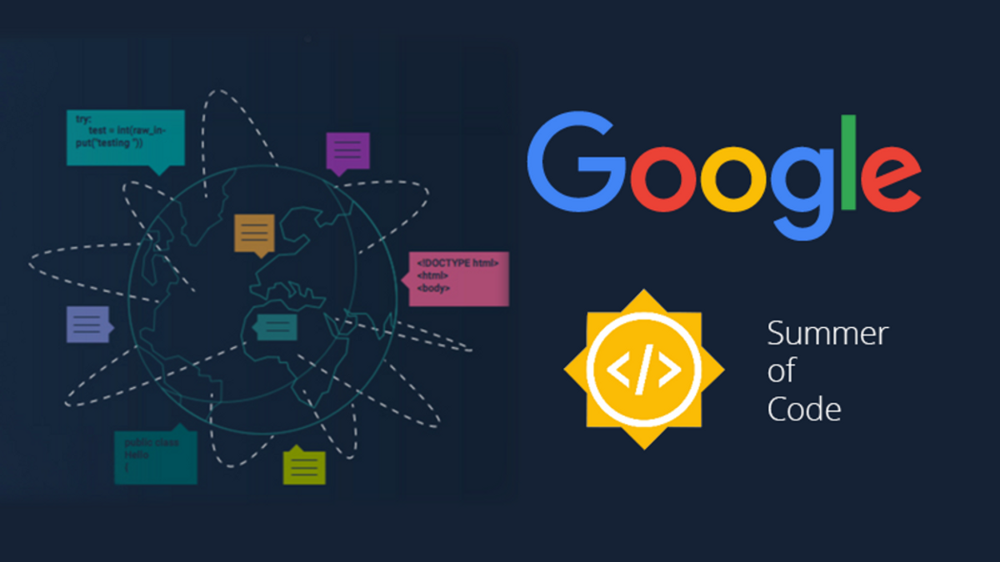

# List Of organizations coming in GSoC 2022 🤯🧠

It is pretty hard to say for sure which organization will be chosen. There are many factors that determine which organization Google chooses, So what one can do is to make a checklist for the organizations that are participating for the last five years.

To help you all and save your time over these exam period here I am writing another blog where I listed all the organization that are recurring for five years.

### List of probable orgs coming in 2022.

| Serial No. | Organizations                           | 2017 | 2018 | 2019 | 2020 | 2021 |
| ---------- | --------------------------------------- | ---- | ---- | ---- | ---- | ---- |
| 1          | 52 north                                | ✅   | ✅   | ✅   | ✅   | ✅   |
| 2          | About Code                              | ✅   | ⛔   | ✅   | ✅   | ✅   |
| 3          | Accord Project                          | ⛔   | ⛔   | ⛔   | ✅   | ✅   |
| 4          | Aerospace Research                      | ✅   | ✅   | ✅   | ✅   | ✅   |
| 5          | AFL++                                   | ⛔   | ⛔   | ⛔   | ⛔   | ✅   |
| 6          | Graphic Fuzz                            | ⛔   | ⛔   | ⛔   | ✅   | ✅   |
| 7          | Ankidroid                               | ⛔   | ⛔   | ⛔   | ⛔   | ✅   |
| 8          | Aossic                                  | ✅   | ✅   | ✅   | ✅   | ✅   |
| 9          | Apertium                                | ✅   | ✅   | ✅   | ✅   | ✅   |
| 10         | Apertus                                 | ✅   | ✅   | ✅   | ✅   | ✅   |
| 11         | Ardupilot                               | ✅   | ✅   | ✅   | ✅   | ✅   |
| 12         | Audacity                                | ⛔   | ⛔   | ⛔   | ⛔   | ✅   |
| 13         | Beagleboard                             | ✅   | ✅   | ✅   | ✅   | ✅   |
| 14         | Bench-Routes                            | ⛔   | ⛔   | ⛔   | ⛔   | ✅   |
| 15         | Blender                                 | ✅   | ✅   | ✅   | ✅   | ✅   |
| 16         | Boost C++                               | ✅   | ✅   | ✅   | ✅   | ✅   |
| 17         | BRL-CAD                                 | ✅   | ✅   | ✅   | ✅   | ✅   |
| 18         | CaMicroscope                            | ⛔   | ⛔   | ⛔   | ✅   | ✅   |
| 19         | Casbin                                  | ⛔   | ⛔   | ⛔   | ✅   | ✅   |
| 20         | Castor                                  | ⛔   | ⛔   | ⛔   | ⛔   | ✅   |
| 21         | CC Extracter                            | ⛔   | ✅   | ✅   | ✅   | ✅   |
| 22         | Cross                                   | ⛔   | ✅   | ✅   | ✅   | ✅   |
| 23         | Ceph                                    | ✅   | ⛔   | ⛔   | ✅   | ✅   |
| 24         | CERN-HSF                                | ✅   | ✅   | ✅   | ✅   | ✅   |
| 25         | CGAL project                            | ⛔   | ✅   | ✅   | ✅   | ✅   |
| 26         | CHAOSS project                          | ⛔   | ✅   | ✅   | ✅   | ✅   |
| 27         | Chapel                                  | ⛔   | ✅   | ✅   | ✅   | ✅   |
| 28         | Check Style                             | ✅   | ✅   | ✅   | ✅   | ✅   |
| 29         | Chromium                                | ⛔   | ⛔   | ⛔   | ⛔   | ✅   |
| 30         | Cilium                                  | ⛔   | ⛔   | ⛔   | ⛔   | ✅   |
| 31         | CircuitVerse.org                        | ⛔   | ⛔   | ✅   | ✅   | ✅   |
| 32         | CiviCRM                                 | ⛔   | ✅   | ✅   | ✅   | ✅   |
| 33         | CloudCV                                 | ✅   | ✅   | ✅   | ✅   | ✅   |
| 34         | Coala                                   | ✅   | ✅   | ✅   | ✅   | ✅   |
| 35         | CD Foundation                           | ⛔   | ⛔   | ⛔   | ✅   | ✅   |
| 36         | CRIU                                    | ⛔   | ✅   | ✅   | ✅   | ✅   |
| 37         | Cuneiform digital Library               | ⛔   | ⛔   | ⛔   | ⛔   | ✅   |
| 38         | Dart                                    | ⛔   | ⛔   | ⛔   | ✅   | ✅   |
| 39         | Dbpedia                                 | ✅   | ✅   | ✅   | ✅   | ✅   |
| 40         | Debian                                  | ⛔   | ✅   | ✅   | ✅   | ✅   |
| 41         | DeepPavlov                              | ⛔   | ⛔   | ⛔   | ⛔   | ✅   |
| 42         | Department of BMI                       | ✅   | ⛔   | ✅   | ⛔   | ✅   |
| 43         | Dial                                    | ⛔   | ✅   | ✅   | ✅   | ✅   |
| 44         | dJango                                  | ✅   | ✅   | ✅   | ⛔   | ✅   |
| 45         | ELM tooling                             | ✅   | ⛔   | ✅   | ✅   | ✅   |
| 46         | FF mpeg                                 | ✅   | ✅   | ✅   | ✅   | ✅   |
| 47         | Fortan-lang                             | ⛔   | ⛔   | ⛔   | ⛔   | ✅   |
| 48         | Fossology                               | ⛔   | ✅   | ✅   | ✅   | ✅   |
| 49         | Framenet                                | ⛔   | ⛔   | ✅   | ✅   | ✅   |
| 50         | Free and open Source Silicon            | ✅   | ✅   | ✅   | ✅   | ✅   |
| 51         | Free bsd                                | ✅   | ✅   | ✅   | ✅   | ✅   |
| 52         | Free type                               | ✅   | ✅   | ✅   | ✅   | ✅   |
| 53         | Freifunk.net                            | ✅   | ✅   | ✅   | ✅   | ✅   |
| 54         | FR Routing                              | ⛔   | ⛔   | ⛔   | ✅   | ✅   |
| 55         | Genome Assembly and Annotation          | ✅   | ⛔   | ⛔   | ⛔   | ✅   |
| 56         | Gentoo Foundation                       | ✅   | ✅   | ✅   | ✅   | ✅   |
| 57         | Geom Scale                              | ⛔   | ⛔   | ⛔   | ✅   | ✅   |
| 58         | GFOSS                                   | ✅   | ✅   | ⛔   | ✅   | ✅   |
| 59         | Git                                     | ✅   | ✅   | ✅   | ✅   | ✅   |
| 60         | GitLab                                  | ⛔   | ⛔   | ⛔   | ⛔   | ✅   |
| 61         | Global Alliance for genomics and health | ⛔   | ✅   | ✅   | ✅   | ✅   |
| 62         | GNOME Foundation                        | ✅   | ✅   | ✅   | ✅   | ✅   |
| 63         | GNSS-SDR                                | ✅   | ✅   | ✅   | ✅   | ✅   |
| 64         | GNU GCC                                 | ✅   | ✅   | ✅   | ✅   | ✅   |
| 65         | GNU Mailman project                     | ⛔   | ⛔   | ✅   | ⛔   | ✅   |
| 66         | GNU Octave                              | ✅   | ✅   | ✅   | ✅   | ✅   |
| 67         | GNU Radio                               | ✅   | ✅   | ✅   | ✅   | ✅   |
| 68         | Gadot                                   | ⛔   | ✅   | ✅   | ✅   | ✅   |
| 69         | Google FHIR SDK                         | ⛔   | ⛔   | ⛔   | ⛔   | ✅   |
| 70         | gprMax                                  | ⛔   | ⛔   | ✅   | ✅   | ✅   |
| 71         | GPR rapid response                      | ⛔   | ⛔   | ⛔   | ⛔   | ✅   |
| 72         | gVisor                                  | ⛔   | ⛔   | ⛔   | ⛔   | ✅   |
| 73         | HAIKU                                   | ✅   | ✅   | ✅   | ✅   | ✅   |
| 74         | Halide                                  | ⛔   | ⛔   | ⛔   | ⛔   | ✅   |
| 75         | Haskell                                 | ✅   | ✅   | ✅   | ✅   | ✅   |
| 76         | Hydra EcoSystem                         | ✅   | ✅   | ✅   | ✅   | ✅   |
| 77         | INCF                                    | ✅   | ✅   | ✅   | ✅   | ✅   |
| 78         | Inkspace                                | ✅   | ✅   | ✅   | ✅   | ✅   |
| 79         | Integrated Ocean Observing System       | ⛔   | ⛔   | ⛔   | ⛔   | ✅   |
| 80         | Intel Video and Audio for Linux         | ✅   | ⛔   | ✅   | ✅   | ✅   |
| 81         | CATROBAT.org                            | ✅   | ✅   | ✅   | ✅   | ✅   |
| 82         | Intel archive                           | ⛔   | ⛔   | ⛔   | ⛔   | ✅   |
| 83         | JabRefev                                | ⛔   | ⛔   | ⛔   | ⛔   | ✅   |
| 84         | Java pathFinder                         | ✅   | ✅   | ✅   | ✅   | ✅   |
| 85         | Jboss Community                         | ✅   | ✅   | ✅   | ✅   | ✅   |
| 86         | Jde Robot-Universided Rey Juan Carlos   | ✅   | ✅   | ✅   | ✅   | ✅   |
| 87         | Joomla!                                 | ✅   | ✅   | ✅   | ✅   | ✅   |
| 88         | Joplin                                  | ⛔   | ⛔   | ⛔   | ⛔   | ✅   |
| 89         | KDE Community                           | ✅   | ✅   | ✅   | ✅   | ✅   |
| 90         | Kiwix                                   | ⛔   | ✅   | ✅   | ✅   | ✅   |
| 91         | Kodi                                    | ✅   | ✅   | ✅   | ✅   | ✅   |
| 92         | LabLua                                  | ✅   | ✅   | ✅   | ✅   | ✅   |
| 93         | Learning Equality                       | ⛔   | ⛔   | ⛔   | ⛔   | ✅   |
| 94         | Lib Camera                              | ⛔   | ⛔   | ⛔   | ⛔   | ✅   |
| 95         | Libre Space foundation                  | ⛔   | ⛔   | ✅   | ✅   | ✅   |
| 96         | Libre Cube                              | ⛔   | ⛔   | ⛔   | ⛔   | ✅   |
| 97         | Livre Health                            | ✅   | ✅   | ✅   | ✅   | ✅   |
| 98         | Libre Office                            | ✅   | ✅   | ✅   | ✅   | ✅   |
| 99         | Libvirt                                 | ✅   | ✅   | ✅   | ✅   | ✅   |
| 100        | Liquid Galaxy Project                   | ✅   | ✅   | ✅   | ✅   | ✅   |
| 111        | ML4SCL                                  | ⛔   | ⛔   | ⛔   | ⛔   | ✅   |
| 112        | MapAction                               | ⛔   | ⛔   | ⛔   | ⛔   | ✅   |
| 113        | MariaDB foundation                      | ✅   | ✅   | ✅   | ✅   | ✅   |
| 114        | Matrix                                  | ✅   | ✅   | ✅   | ✅   | ✅   |
| 115        | New Urban mechanics                     | ⛔   | ⛔   | ⛔   | ⛔   | ✅   |
| 116        | MBDyn                                   | ✅   | ✅   | ✅   | ✅   | ✅   |
| 117        | MD analysis                             | ⛔   | ⛔   | ⛔   | ⛔   | ✅   |
| 118        | Meta Brainz                             | ✅   | ✅   | ✅   | ✅   | ✅   |
| 119        | MetaCell                                | ⛔   | ⛔   | ⛔   | ⛔   | ✅   |
| 120        | Metasploit                              | ✅   | ✅   | ✅   | ✅   | ✅   |
| 121        | MGGG redistricting Lab                  | ⛔   | ⛔   | ⛔   | ⛔   | ✅   |
| 122        | MIT App Inventor                        | ✅   | ⛔   | ✅   | ✅   | ✅   |
| 123        | mlpack                                  | ✅   | ✅   | ✅   | ✅   | ✅   |
| 124        | Movelt                                  | ⛔   | ⛔   | ⛔   | ⛔   | ✅   |
| 125        | MuseScore                               | ✅   | ✅   | ✅   | ✅   | ✅   |
| 126        | mypy                                    | ⛔   | ⛔   | ⛔   | ⛔   | ✅   |
| 127        | NRNB                                    | ✅   | ✅   | ✅   | ✅   | ✅   |
| 128        | Navidrome                               | ⛔   | ⛔   | ⛔   | ⛔   | ✅   |
| 129        | NumFOCUS                                | ✅   | ✅   | ✅   | ✅   | ✅   |
| 130        | Open Bioinformatics Foundation          | ✅   | ✅   | ✅   | ✅   | ✅   |
| 131        | Open chemistry                          | ✅   | ✅   | ✅   | ✅   | ✅   |
| 132        | Open Genome Informatics                 | ✅   | ⛔   | ⛔   | ✅   | ✅   |
| 133        | Open ROBERTA                            | ⛔   | ✅   | ✅   | ✅   | ✅   |
| 134        | Open Robotics                           | ⛔   | ✅   | ✅   | ✅   | ✅   |
| 135        | Open Astronomy                          | ✅   | ✅   | ✅   | ✅   | ✅   |
| 136        | OpenCV                                  | ✅   | ⛔   | ✅   | ⛔   | ✅   |
| 137        | OpenMined                               | ⛔   | ⛔   | ✅   | ✅   | ✅   |
| 138        | OpenMRS                                 | ✅   | ✅   | ✅   | ✅   | ✅   |
| 139        | OpenStrrtMap                            | ✅   | ✅   | ✅   | ✅   | ✅   |
| 140        | OpenSUSE                                | ✅   | ✅   | ✅   | ⛔   | ✅   |
| 142        | OpenWisp                                | ✅   | ✅   | ✅   | ✅   | ✅   |
| 143        | Oppia                                   | ✅   | ✅   | ✅   | ✅   | ✅   |
| 144        | ORCASOUND                               | ⛔   | ⛔   | ⛔   | ⛔   | ✅   |
| 145        | OSGeo                                   | ✅   | ✅   | ✅   | ✅   | ✅   |
| 146        | OWASP                                   | ⛔   | ✅   | ✅   | ✅   | ✅   |
| 147        | PEcAn                                   | ⛔   | ✅   | ✅   | ✅   | ✅   |
| 148        | Pharo Consortium                        | ✅   | ⛔   | ✅   | ⛔   | ✅   |
| 149        | Pidgin Instant Messenger                | ⛔   | ⛔   | ⛔   | ⛔   | ✅   |
| 150        | Pitivi                                  | ⛔   | ⛔   | ✅   | ✅   | ✅   |
| 151        | Plan 9 Foundation                       | ⛔   | ⛔   | ⛔   | ⛔   | ✅   |
| 152        | point cloud library                     | ⛔   | ⛔   | ⛔   | ✅   | ✅   |
| 153        | Polypheny                               | ⛔   | ⛔   | ⛔   | ⛔   | ✅   |
| 154        | PostgreSQL                              | ✅   | ✅   | ✅   | ✅   | ✅   |
| 155        | Postman                                 | ⛔   | ⛔   | ⛔   | ✅   | ✅   |
| 156        | Processing Foundation                   | ✅   | ✅   | ✅   | ✅   | ✅   |
| 157        | Project Wikiloop                        | ⛔   | ⛔   | ⛔   | ⛔   | ✅   |
| 158        | Public Lab                              | ✅   | ⛔   | ✅   | ⛔   | ✅   |
| 159        | Purr Data                               | ⛔   | ✅   | ✅   | ✅   | ✅   |
| 160        | Python                                  | ✅   | ✅   | ✅   | ✅   | ✅   |
| 161        | QEMU                                    | ⛔   | ✅   | ✅   | ✅   | ✅   |
| 162        | Qubes OS                                | ✅   | ⛔   | ⛔   | ✅   | ✅   |
| 163        | React Native Elements                   | ⛔   | ⛔   | ⛔   | ⛔   | ✅   |
| 164        | React OS                                | ✅   | ✅   | ✅   | ✅   | ✅   |
| 165        | Red Hen Labs                            | ✅   | ✅   | ✅   | ✅   | ✅   |
| 166        | Rizin                                   | ⛔   | ⛔   | ⛔   | ⛔   | ✅   |
| 167        | RoboComp                                | ✅   | ✅   | ✅   | ✅   | ✅   |
| 168        | Rocket.Chat                             | ✅   | ✅   | ✅   | ✅   | ✅   |
| 169        | RTEMS project                           | ✅   | ✅   | ✅   | ✅   | ✅   |
| 170        | RUBY                                    | ✅   | ✅   | ✅   | ✅   | ✅   |
| 171        | Sagemath                                | ✅   | ✅   | ✅   | ✅   | ✅   |
| 172        | Samba                                   | ✅   | ⛔   | ✅   | ✅   | ✅   |
| 173        | ScalaCenter                             | ✅   | ✅   | ⛔   | ⛔   | ✅   |
| 174        | Core                                    | ✅   | ✅   | ✅   | ✅   | ✅   |
| 175        | ScummVM                                 | ✅   | ✅   | ✅   | ✅   | ✅   |
| 176        | Swift                                   | ⛔   | ⛔   | ✅   | ✅   | ✅   |
| 177        | Software Heritage                       | ⛔   | ⛔   | ✅   | ⛔   | ✅   |
| 178        | SPDX                                    | ✅   | ✅   | ✅   | ✅   | ✅   |
| 179        | STELLAR group                           | ✅   | ✅   | ⛔   | ⛔   | ✅   |
| 180        | Strance                                 | ✅   | ✅   | ✅   | ✅   | ✅   |
| 181        | Sugar                                   | ✅   | ✅   | ✅   | ✅   | ✅   |
| 182        | SymbiFlow                               | ⛔   | ⛔   | ✅   | ✅   | ✅   |
| 183        | sympy                                   | ✅   | ✅   | ✅   | ✅   | ✅   |
| 184        | Suynfig                                 | ⛔   | ⛔   | ✅   | ✅   | ✅   |
| 185        | syslog-ng                               | ⛔   | ✅   | ✅   | ✅   | ✅   |
| 186        | Tarantool                               | ⛔   | ⛔   | ⛔   | ⛔   | ✅   |
| 187        | TARDIS SN                               | ⛔   | ⛔   | ⛔   | ⛔   | ✅   |
| 188        | Tensorflow                              | ⛔   | ⛔   | ✅   | ✅   | ✅   |
| 189        | The Apache Software Foundation          | ✅   | ✅   | ✅   | ✅   | ✅   |
| 190        | The ENGIMA Team                         | ⛔   | ⛔   | ⛔   | ⛔   | ✅   |
| 191        | The Honeynet Project                    | ✅   | ✅   | ✅   | ✅   | ✅   |
| 192        | Julia                                   | ✅   | ✅   | ✅   | ✅   | ✅   |
| 193        | The Libreswan Project                   | ✅   | ✅   | ✅   | ✅   | ✅   |
| 194        | The LINUX Foundation                    | ✅   | ✅   | ✅   | ✅   | ✅   |
| 195        | The LLVM Compiler infrastructure        | ✅   | ✅   | ✅   | ✅   | ✅   |
| 196        | NetBSD                                  | ✅   | ✅   | ✅   | ✅   | ✅   |
| 197        | ns-3                                    | ✅   | ✅   | ✅   | ✅   | ✅   |
| 198        | The Palisadoes                          | ⛔   | ⛔   | ⛔   | ⛔   | ✅   |
| 199        | The R project for statistical Computing | ✅   | ✅   | ✅   | ✅   | ✅   |
| 200        | Terasology                              | ✅   | ✅   | ✅   | ✅   | ✅   |
| 201        | Tianocore                               | ⛔   | ⛔   | ⛔   | ⛔   | ✅   |
| 202        | VideoLAN                                | ✅   | ✅   | ✅   | ✅   | ✅   |
| 203        | vitrivr                                 | ⛔   | ✅   | ⛔   | ⛔   | ✅   |
| 204        | wikimedia                               | ✅   | ✅   | ✅   | ✅   | ✅   |
| 205        | Xfce                                    | ⛔   | ⛔   | ⛔   | ⛔   | ✅   |
| 206        | xiph.org                                | ⛔   | ⛔   | ⛔   | ⛔   | ✅   |
| 207        | xrDesktop                               | ⛔   | ⛔   | ⛔   | ⛔   | ✅   |
| 208        | XWIKI                                   | ✅   | ✅   | ✅   | ✅   | ✅   |
| 209        | Zulip                                   | ✅   | ✅   | ✅   | ✅   | ✅   |

  

<a href="./images/GSoC_ORGS.xlsx" download>Download your own copy of list 📚</a>

  
