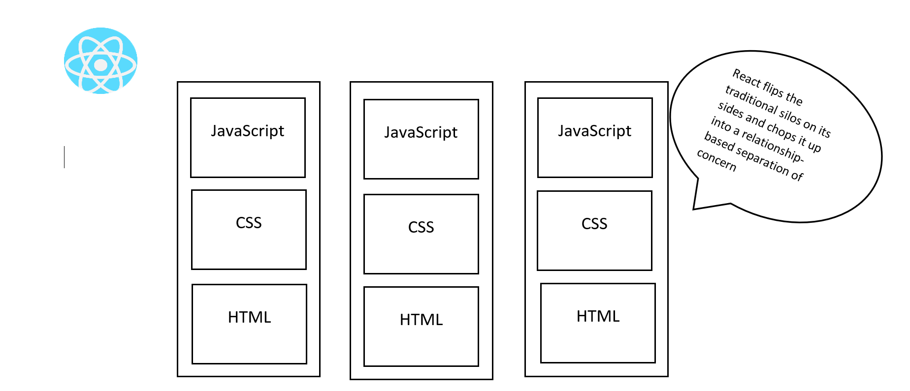
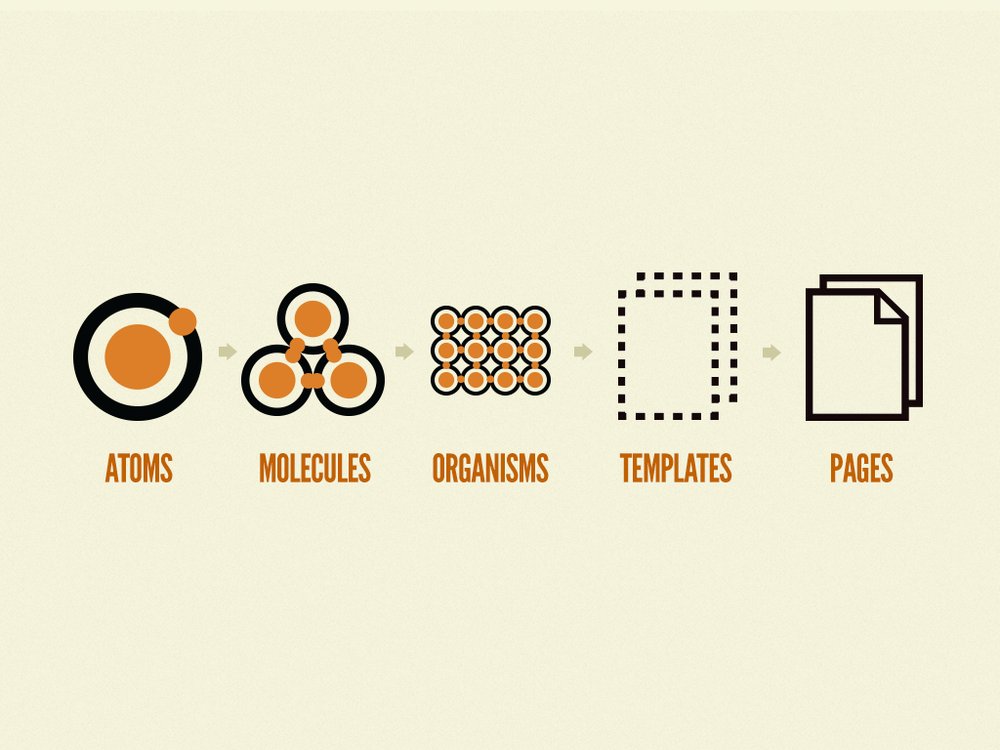

# Thinking In  : A Design First Approach ⚛️

 

  

**⚛️ How React is making UI the center-piece of frontend development ⚛️**

For a non-designer, thinking in visual components can be a strange process — especially if you’re new to React, or are just moving into frontend development. Our main modes of operations tend to sit at the logical layer, where business rules materialize and connections are made. For non-native frontend developers, there is often a disconnect between the visual world and code.

Since its release, React has made waves. Its popularity has exploded over the past few years with React being included as part of the tech stacks required for jobs like full-stack web developer, frontend JavaScript engineer, and UX developer.

In short, React is in demand, and getting React code right can be a mission if you’re not used to a design-first approach mode of thinking.

# What Is A Design First Approach?

We often hear of development processes such as ‘mobile first’ and ‘progressive web first’, but what is a ‘design first’ approach?

A design-first approach emphasizes the core and individual visual elements of an application. Rather than viewing everything as ‘pages’, each element is constructed as stand-alone modules where functionality can be hooked in.

React works well with this idea because it is component-based by structural design, making it easier than other frameworks and libraries to demarcate the boundaries between UX/UI and the logical layers. This is because the separation of concerns can be based on each visual element rather than the contents of a page. Your component code is not split between different files and generally stays compact in a single file. This allows you to compose your final view easily by pulling in each component and connecting them up as necessary.

# Atomic Design Principles In a Nutshell 🥜

When it comes to code, a developer’s job involves figuring out the balance between abstraction and practicality. A particular component — such as a submission form — may be made up of multiple elements. These elements can include input fields, checkboxes, date pickers, value sliders, toggles, and submission buttons.

<a href="https://bradfrost.com/blog/post/atomic-web-design/" style="color: #b5179e">Atomic design</a> is a popular design principle developed by <a href="https://bradfrost.com/" style="color: #b5179e">Brad Frost.</a> It that deals with breaking down each element in an application to its smallest component, then bringing them together as necessary to form collections that are eventually used to form templates. These templates are then placed on pages to construct the final view.

Original diagram for Atomic Design by Brad Frost
  
Original diagram for Atomic Design by Brad Frost

This way of thinking about design allows designers and developers to create designs and code that is consistent through repeatable processes. Once the core components are created, it becomes a process of mixing and matching to create collections and templates that can easily be placed on a page.

React’s component modules allow for this kind of visual implementation to be represented on a code level. The logical layers and state management of React work on a common abstraction principle — where states and functionality are abstracted only if it continues to work on the lowest common visual denominator. This allows React to keep the logical layers unconnected from the visual layer until the last possible moment, allowing developers to modularize the code and maintain loosely coupled relationships.

# Code and Design In Teams 🦸‍♂️

With a design-first approach, rapid and agile product development is possible because a UX/UI designer can give the developer the component files to work on while they construct the final templates and views.

In an agile environment, everything tends to be developed in conjunction with each other rather than through sequential processes. This often makes it hard for developers to figure out how to architecture their visual elements, especially if minimal details are given.

However, with a design-first approach, the separation between component parts, templating and final view from the logical layer makes it easier to separate code domains and concerns. The visual elements remain isolated from the logical layers until it is required to be connected.

React works well with this process because its core focus and philosophy are centralized around a user interface-first approach. It allows for code and design to develop in conjunction with each other rather than as isolated processes that can only begin when the other has been completed. When code and design are able to run in parallel, it allows the designer and developer to uniquely collaborate, clarify, and create rapid prototypes, resulting in a faster, and overall more effective and efficient team workflow.

Final thoughts

React’s popularity is not a mistake. Being a library that focuses on UI creation means that developers are not distracted by complicated structures and architectures.

While the front end is only one layer of the overall application and code architectures that make an app possible, it is what the customer experiences. The front end has the potential to make or break a sale, convert a user, and imprint customers to your brand.

When the UI is easy to structure and move around, it makes rapid prototyping for the UX much easier — and React just makes it that much easier.

   
